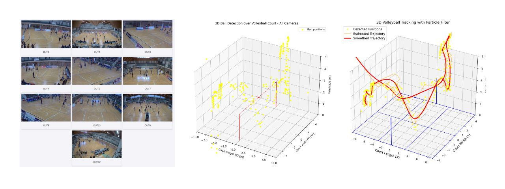

# 3D Camera Calibration (Geometry and 3D Reconstruction)

## Description




## Repository Structure

```python
3D-camera-calibration/
├── readme/                # Readme images
├── report/                # Project Report
├── calibration/           # Calibration scripts
│   ├── preprocessing.py
│   ├── intrinsic.py 
│   ├── extrinsic.py
│   ├── undistort.py
│   └── utils/ 
│       ├── calibration_utils.py 
│       └── parameters.py 
├── annotation/            # Annotation scripts
│   ├── preprocessing.py
│   ├── intrinsic.py 
│   ├── extrinsic.py
│   ├── undistort.py
│   └── utils/ 
│       ├── calibration_utils.py 
│       └── parameters.py 
├── viewer/                # Tool
│   ├── app.py
│   ├── static/ 
│   │   ├── images/ 
│   │   ├── style.css 
│   │   └── court.jpg 
│   ├── homography/ 
│   │   └── homography.py 
│   └── templates/ 
│       └── index.html 
├── video/                  # Video
│   ├── board/
│   └── match/ 
│  
├── requirements.txt
├── README.md
└── LICENSE

```

## Environment Setup

To ensure compatibility and reproducibility, this project requires Python and the necessary packages. Follow the steps below to set up the environment.

1. Clone the Repository to your local machine

```bash
git clone https://github.com/
cd nome/
```

2. Create a virtual environment

```bash
python -m venv env
```

3. Activate the virtual environment and install the required packages

```bash
source venv/bin/activate # MacOS and Linux
venv\Scripts\activate # Windows
```

## Usage

In the `parameters.py` file, you can modify the parameters used by the tool.

### Frame Extraction
To process videos and extract frames, use the following command:
```bash
./preprocessing.sh
```
This command will create a folder named `src-gen`, which will contain the extracted frames for each video.

### Intrinsic and Extrinsic Calibration
After extracting the frames, you can run the intrinsic and extrinsic calibration using the following commands:
1. Intrinsic Calibration:
```bash
./intrinsic.sh
```
2. Extrinsic Calibration:
```bash
./extrinsic.sh
```
Make sure to check the output for any errors and verify that the calibration results are as expected.

### 3D Reconstruction Viewer
To start the 3D Reconstruction Viewer tool:
```bash
python3 viewer/app.py
```
Open your web browser and go to http://127.0.0.1:5000/ to access the 3D Reconstruction Viewer. 


## Contributors

| **Name**                |       
|-------------------------|
| Ylenia Graziadei        | 
| Pietro Lechthaler       |
