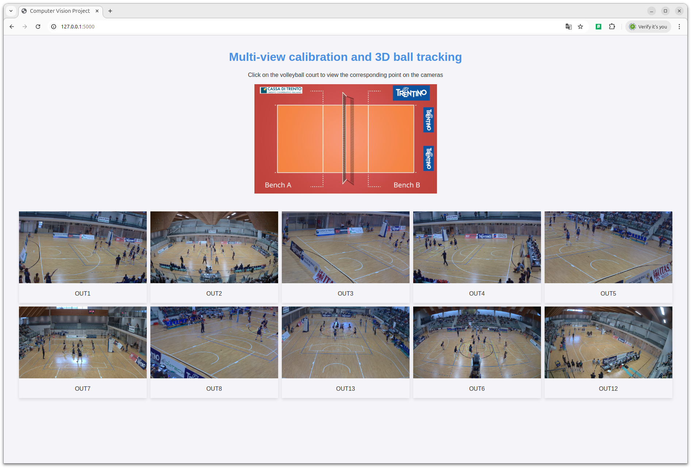
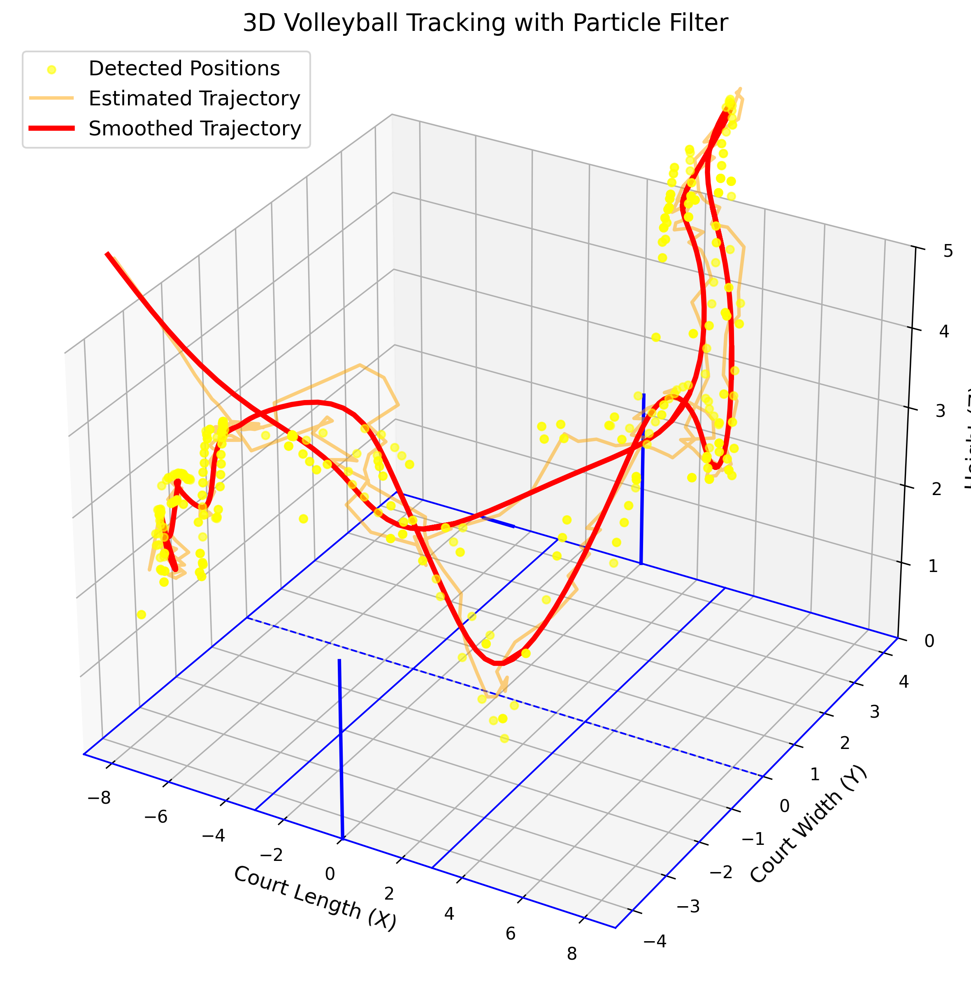

# Multi-view calibration and 3D ball tracking
## Description

This repository presents a tool for `3D volleyball court reconstruction and ball tracking` using a multi-camera system composed of 10 synchronized cameras strategically positioned around the court. The proposed pipeline integrates intrinsic and extrinsic camera calibration. Intrinsic calibration estimates each camera’s focal length, principal point, and lens distortion to correct image deformations, while extrinsic calibration determines the cameras’ positions and orientations within a shared 3D coordinate system.
For `intrinsic calibration`, the official OpenCV Calibration Method is employed with a checkerboard pattern. `Extrinsic parameters` are optimized using Perspective-n-Point (PnP) algorithms and bundle adjustment by matching key-points across multiple views.
By combining these calibrations with multi-view geometry and deep learning-based ball detection (`YOLOv11`), the system achieves robust 3D localization of the volleyball, even under challenging conditions such as occlusions and rapid motion. 
To model trajectory dynamics, a `particle filter` is implemented, incorporating physics-based motion priors to enable accurate predictions during brief detection dropouts. The estimated trajectory is further refined using a low-pass filter.


## Environment Setup

To ensure compatibility and reproducibility, this project requires Python and the necessary packages. Follow the steps below to set up the environment.

1. Clone the Repository to your local machine

```bash
git clone https://github.com/pietrolechthaler/MultiViewCalibration-BallTracking.git
cd MultiViewCalibration-BallTracking/
```

2. Create a virtual environment

```bash
python -m venv env
```

3. Activate the virtual environment and install the required packages

```bash
source env/bin/activate # MacOS and Linux
env\Scripts\activate # Windows
```

```bash
pip install -r requirements.txt
```

## Usage

In the `parameters.py` file, you can modify the parameters used by the tool.

### Frame Extraction
To process videos and extract frames, use the following command:
```bash
./preprocessing.sh
```
This command will create a folder named `src-gen`, which will contain the extracted frames for each video.

### Intrinsic and Extrinsic Calibration
After extracting the frames, you can run the intrinsic and extrinsic calibration using the following commands:
1. Intrinsic Calibration:
```bash
./intrinsic.sh
```
2. Extrinsic Calibration:
```bash
./extrinsic.sh
```
Make sure to check the output for any errors and verify that the calibration results are as expected.

### 3D Reconstruction Viewer


To start the 3D Reconstruction Viewer tool:
```bash
./viewer_linux.sh # MacOS and Linux
./viewer_windows.sh # Windows
```
Open your web browser and go to http://127.0.0.1:5000/ to access the 3D Reconstruction Viewer. 


### Ball detection and 3D position estimation


To run the ball detection script, use the following command:
```bash
./detection.sh
```


Once the ball detection process is complete, you can proceed to run the 3D tracking script with the following command:
```bash
./tracking.sh
```


## Contributors
Ylenia Graziadei, Pietro Lechthaler

The project has been built and tested on the following systems:
- Windows 11 Pro, Python 3.10.14
- Ubuntu 24.10, Python 3.12.7
